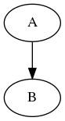

# DAGSON
A JSON seralization format for Direct Acyclic Graphs (DAGs), with optional properties for the DAG, nodes and transisitions.

Version: 0.1

Datetime: 2018-07-29T:57:01Z

##
File extension: `.dag`



```yaml
---

["A", "B"]

["A", "B", "C"]

["A", "B", {{{"name": "graph"}}}]

---

["A", , {"key" "value"}, "B"]

["A", {"key1": "value1", "key2": "value2"}}, "B"]

["A", {"key1": "value1"}, "B", {"key2": "value2"}]

["A", "B", {"key": "value"}]

["A", {"key": "value"}, "B", "C"]

["A", "B", {"key": "value"}, "C"]

["A", "B", "C", {"key": "value"}]

---

[["A", "B"], {"key": "value"}]

["A", "B", "C"], {"key": "value"}]

---

["A", {{"key1": "value1"}}, "B"]

[["A", "B", "C"], {{"key1": "value1"}}]

["A", {{"key1": "value1"}}, "B", {{"key2": "value2"}}, "C"]

["A", {"key1": "value1"}, {{"key2": "value2"}}, "B"]

---

[["A", "B"], ["A", "C"]]

[["A", "B", "C"], ["A", "C"]]

[["A", "B"], ["A", "C"], ["A", "D"], ["B", "C"], ["B", "D"], ["C", "D"]]

[["A", "B", "C", "D"], ["A", "C"], ["A", "D"], ["B", "D"]]

---

["A", ["B"], "C"]

["A", ["B", "C"], "C"]

["A", ["B", ["C"], "D"], "C", "D"]

---

[["A", "C"], ["B", "C"]]

---

[["A", ["B", {{"key2": null}}, "C"], "C"], {{"key1": "value1", "key2": "value2"}}]
```
